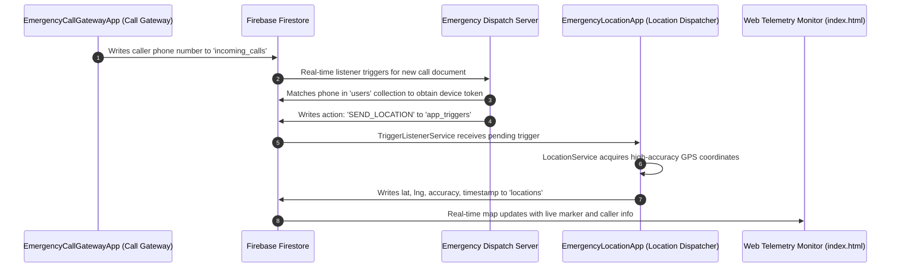

# Emergency Response System (ERS)

A distributed emergency response platform designed for real-time caller detection, emergency dispatch, and precision GPS location tracking.

---

## 📱 Repository Structure

```
ERS/
├── EmergencyLocationApp/         # GPS Location Dispatcher & Emergency Dashboard App
│   ├── app/                      # Source code, assets, manifests, and configs
│   │   ├── src/main/java/        # Kotlin source files
│   │   ├── src/main/res/         # UI layouts, drawables, strings
│   │   └── google-services.json  # Firebase configuration
│   ├── apk/                      # Ready-to-install Android APK
│   │   └── EmergencyLocationApp-debug.apk
│   └── build.gradle.kts          # Gradle build script
│
├── EmergencyCallGatewayApp/      # Incoming Call Monitoring & Trigger Gateway App
│   ├── app/                      # Source code, assets, manifests, and configs
│   │   ├── src/main/java/        # Kotlin source files
│   │   ├── src/main/res/         # UI layouts, drawables, strings
│   │   └── google-services.json  # Firebase configuration
│   ├── apk/                      # Ready-to-install Android APK
│   │   └── EmergencyCallGatewayApp-debug.apk
│   └── build.gradle.kts          # Gradle build script
│
├── index.html                    # Real-time Web Telemetry & Map Monitor Dashboard
├── .gitignore
└── README.md
```

---

## 🚀 The Applications

### 1. `EmergencyLocationApp` (GPS Dispatcher)
* **Package**: `com.example.myapplication`
* **APK**: [`EmergencyLocationApp/apk/EmergencyLocationApp-debug.apk`](EmergencyLocationApp/apk/EmergencyLocationApp-debug.apk)
* **Key Components**:
  * `RegistrationActivity.kt`: Registers the device token, user name, and phone number into Firebase Firestore (`users` collection).
  * `DashboardActivity.kt`: Emergency control dashboard displaying live GPS status, connection state, manual diagnostic triggers, and coordinates.
  * `TriggerListenerService.kt`: Persistent background foreground service that monitors the Firestore `app_triggers` collection in real-time.
  * `LocationService.kt`: Awakens when a `SEND_LOCATION` trigger is detected, interfaces with hardware GPS sensors via `GPSHelper.kt`, and uploads precision latitude/longitude/accuracy to Firestore's `locations` collection.
  * `FirestoreHelper.kt`: Firestore database helper for real-time document manipulation.

### 2. `EmergencyCallGatewayApp` (Call Monitor Gateway)
* **Package**: `com.example.myapplication2`
* **APK**: [`EmergencyCallGatewayApp/apk/EmergencyCallGatewayApp-debug.apk`](EmergencyCallGatewayApp/apk/EmergencyCallGatewayApp-debug.apk)
* **Key Components**:
  * `CallReceiver.kt`: Intercepts `TelephonyManager.ACTION_PHONE_STATE_CHANGED`. When an emergency call rings, it extracts the caller's phone number (with a fallback query to Android's `CallLog`) and immediately writes an entry into Firestore's `incoming_calls` collection.
  * `CallMonitoringService.kt`: Foreground service ensuring the call listener remains alive and active in the background.
  * `MainActivity.kt`: User interface providing monitoring start/stop controls, status displays, and runtime permission management (Call Log, Phone State, Notifications).

---

## 🔄 System Architecture Flow



---

## 📦 How to Install the APKs

You can install both applications directly onto an Android device using `adb`:

```bash
# Install the Location Dispatcher App
adb install -r EmergencyLocationApp/apk/EmergencyLocationApp-debug.apk

# Install the Call Gateway App
adb install -r EmergencyCallGatewayApp/apk/EmergencyCallGatewayApp-debug.apk
```

---

## 🛠️ Building from Source

Prerequisites:
* Android SDK (API 34+)
* Java Development Kit (JDK 17+)
* Gradle Wrapper (included)

To compile either app from the terminal:

```bash
# Build Location App
cd EmergencyLocationApp
./gradlew assembleDebug

# Build Call Gateway App
cd ../EmergencyCallGatewayApp
./gradlew assembleDebug
```
