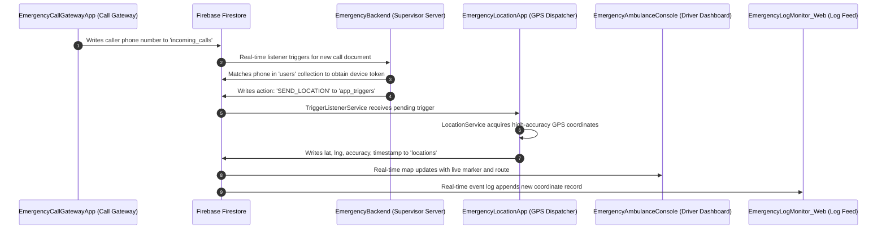

# Emergency Response System (ERS)

A distributed emergency response platform designed for real-time caller detection, emergency dispatch, and precision GPS location tracking.

---

## 🗂️ Complete Repository Structure

```
ERS/
├── EmergencyLocationApp/         # GPS Location Dispatcher & Emergency Dashboard App (Android)
│   ├── app/                      # Source code, assets, manifests, and configs
│   ├── apk/                      # Ready-to-install Android APK (EmergencyLocationApp-debug.apk)
│   └── build.gradle.kts
│
├── EmergencyCallGatewayApp/      # Incoming Call Monitoring & Trigger Gateway App (Android)
│   ├── app/                      # Source code, assets, manifests, and configs
│   ├── apk/                      # Ready-to-install Android APK (EmergencyCallGatewayApp-debug.apk)
│   └── build.gradle.kts
│
├── EmergencyAmbulanceConsole/    # Ambulance Driver Console & Interactive Map Dashboard (Web)
│   ├── index.html                # High-tech Leaflet map & telemetry monitor interface
│   ├── Ambulance Driver Console.lnk # Desktop app shortcut
│   └── README.md
│
├── EmergencyBackend/             # Real-time Call-to-Location Dispatch Server (Node.js)
│   ├── server.js                 # Firestore snapshot listener & user matcher
│   ├── package.json              # Node.js dependencies
│   ├── backend_log.txt           # Supervisor log records
│   └── serviceAccountKey.example.json # Firebase Admin credentials template
│
├── EmergencyLogMonitor_Web/      # Real-time Location Log & Stream Monitor (Web)
│   ├── index.html                # Live Firestore location streaming dashboard
│   ├── backend_log.txt           # Backend runtime execution log
│   └── README.md
│
├── .gitignore
└── README.md
```

---

## 🔄 Complete System Lifecycle



---

## 🚀 Component Breakdown

### 1. `EmergencyLocationApp` (Android)
* **Role**: Runs on the user's phone.
* **Function**: Background service (`TriggerListenerService`) listens for dispatch triggers. When triggered by the backend, `LocationService` fetches live GPS coordinates and pushes them to Firestore.
* **APK**: [`EmergencyLocationApp/apk/EmergencyLocationApp-debug.apk`](EmergencyLocationApp/apk/EmergencyLocationApp-debug.apk)

### 2. `EmergencyCallGatewayApp` (Android)
* **Role**: Runs on the gateway receiver phone.
* **Function**: `CallReceiver` intercepts incoming phone calls, extracts the caller number, and pushes the call to `incoming_calls` in Firestore.
* **APK**: [`EmergencyCallGatewayApp/apk/EmergencyCallGatewayApp-debug.apk`](EmergencyCallGatewayApp/apk/EmergencyCallGatewayApp-debug.apk)

### 3. `EmergencyAmbulanceConsole` (Web)
* **Role**: Primary UI for emergency responders and ambulance drivers.
* **Function**: Visualizes live GPS markers on Leaflet maps, sounds alarms, and displays real-time caller telemetry.

### 4. `EmergencyBackend` (Node.js)
* **Role**: Cloud / local server supervisor.
* **Function**: Continuously listens to `incoming_calls`, looks up caller profiles in `users`, and dispatches `SEND_LOCATION` triggers into `app_triggers`.

### 5. `EmergencyLogMonitor_Web` (Web)
* **Role**: Operations log monitor.
* **Function**: Provides a real-time event feed of all recorded coordinates and server execution status.
